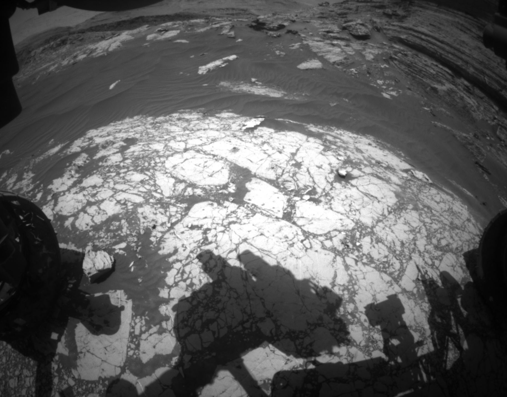

## _A Mars Weather and Astronomy Image App_


Should this project be realized to its authors' vision, a user will be able to press buttons to see Mars's last four Sols' (Martian days') atmospheric pressure averages, an *Astronomy Picture of the Day* with explanation, and the twenty-five most recent images from Curiosity's cameras. Neato.

### Authors **Marni Sucher and Tyler Sinks**
* _originally created March 22, 2021 per a prompt from Epicodus'_ "Learn How to Program: Asynchronoy and APIs" _curriculum_
* _last major revisions March 23 and 24, 2021_

### Technologies Used
* _npm, webpack, webpack-cli_
* _Nasa's Insight weather API and Astronomy Pic of the Day (APOD) API_ _[see Nasa's ASPI docs here](https://api.nasa.gov/)_
* _VS Code, html, CSS, javascript, jquery_
* _bootstrap, ESLint, Babel, Dotenv_
* _for complete list of dependencies, see package.JSON_

### Description
If the stars align, this project consists of a page with three functioning buttons. A click on the "get weather" button pings the Mars Rover weather API and populates the most recent valid data for Mars atmospheric pressure averaged by Sol (Martian Day). Hit the Pic of the Day button to get the astronomy picture of the day. Its explanation gives a little context and shows up just below the image. The last button provides the twenty-five most recent images available from the Curiosity Rover.

### Setup/Installation Requirements
1. Clone this repository to your machine following (these steps)[https://docs.github.com/en/github/creating-cloning-and-archiving-repositories/cloning-a-repository].
Here's the link to this repo: https://github.com/sinkstyt/mars-weather.git
2. Navigate to the root folder of the mars-weather repository in your command line or terminal.
This might look something like:
```
Users/{YOUR_USER_NAME}/Desktop $ mkdir mars-weather
Users/{YOUR_USER_NAME}/Desktop $ cd mars-weather
Users/{YOUR_USER_NAME}/Desktop/mars-weather $
```
3. Tell git to bring down the entire repository using:<br>
`Users/{YOUR_USER_NAME}/Desktop/mars-weather $ git clone https://github.com/sinkstyt/mars-weather.git`
4. Get your own unique Nasa API key by creating a login and requesting one for free (Go there now)[https://api.nasa.gov/]
5. Store your unique API key (it looks something like this: 86a52c0d12da09c0e39fedfb4v89797d) at the root level of this project in a file saved as .env
6. The .env file should have just one line in it like so:<br>
`API_KEY=86a52c0d12da09c0e39fedfb4v89797d` // NOTICE: no quotes or apostrophes around the key itself. Dotenv takes care of bringing the key 
7. From the command line use this series of commands to install the full docket of dependencies and have webapck assemble and launch the project in a browser tab:<br>
```
Users/{YOUR_USER_NAME}/Desktop/mars-weather $ npm install
Users/{YOUR_USER_NAME}/Desktop/mars-weather $ npm run start
```
8. If you're working in a Windows environment, please change the "start": command within scripts in package.json from<br>
```
"scripts": {
  "build": "webpack --mode=development",
  "start": "npm run build; webpack-dev-server --open --mode development",
```
to<br>
```
"scripts": {
  "build": "webpack --mode=development",
  "start": "npm run build & webpack-dev-server --open --mode development", // an & replaces the ;
```

### Known Bugs
* _No known bugs_

### License
_MIT 2.0_<br>
_Feel free to make tweaks_

### Contact
[Tyler Sinks](tyler.sinks@gmail.com)<br>
[Marni Sucher](suchermarni@gmail.com)<br>

### Thank You
NASA<br>
Jet Propulsion Laboratory and Cornell U - *for maintaining the three APIs used here*